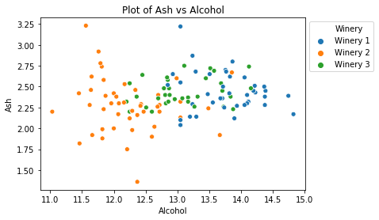
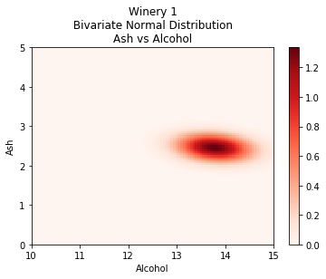
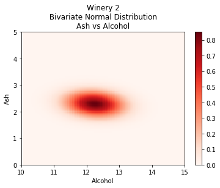
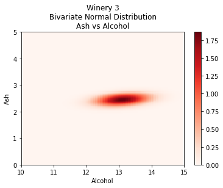

# generative-model

In this notebook, a machine learning model is constructed that can classify a series of wine bottles to one of three wineries of origin. The most sophisticated model that is contructed in these notebooks can correctly classify 98% of wine bottles. The dataset that is used comes from the [UCI Machine Learning Repository](http://archive.ics.uci.edu/ml) and contains 13 numerical indicators for 178 wine bottles. The numerical indicators include the alcohol content and magnesium content, as two examples, for each of the 178 wine bottles.

The machine learning model that is chosen is a *Gaussian generative model*. This type of model fits a Gaussian distribution to each of the three wineries in an attempt to form a profile of each of them. When an unknown wine bottle needs to be classified, the generative model considers a Bayesian approach that weighs up the answers to:

* Which of the three Gaussian distributions for the wineries accommodates this unknown wine bottle the best?
* Of the previously seen wine bottles, which winery was the most frequently occurring? 

In constructing the machine learning models, two thirds of the data is withheld to build the models and one third of data is used to test them.  

This repository contains two notebooks:

* [1-univariate-generative-model.ipynb](1-univariate-generative-model.ipynb)
* [2-multivariate-generative-model.ipynb](2-multivariate-generative-model.ipynb)

## 1-univariate-generative-model.ipynb

This notebook begins by exploring the data for just one feature for one winery. As such, a *univariate* analysis is being conducted. Shown below is a histogram of the alcohol content of the wine bottles originating from Winery 1. In addition to the histogram, a normal distribution is drawn which profiles the alcohol content of wine bottles from Winery 1. 

In the plot below, the characteristic normal distributions of alcohol content are drawn in for all three wineries. As can be seen, Winery 1 produces the wines with the most alcohol and Winery 3 with the least.

Intuitively, the generative model that will be used understands that if a wine bottle has a high alcohol content, than it probably originates from Winery 1. Similary, if the alcohol content is low, then it probably originates from Winery 3. Shown below are the accuracy scores of the generative model for each feature. 

As can be seen, the flavanoids content is the best predictor at 86% and the alcalinity of ash density is the least performing predictor at 42%. In an effort to understand why, the characteristic normal distributions of the flavanoids for the three wineries are shown below:

It can be seen above that for the flavanoids, a generous partitioning occurs for the three wineries, which aids in classification.

The characteristic normal distributions of the alcalinity of ash for the three wineries are shown below:

One can see why the 'Alcalinity of ash' feature is not a good feature for classification. The bell curves of the three wineries are clustered too close together for classification to be effective.

The analysis of this notebook only uses one feature. In the subsequent notebook, multiple features are used in the classification process.

## 2-univariate-generative-model.ipynb

In this notebook, multiple features are used to determine which winery an unknown wine bottle originates from. Shown below is a bivariate plot of the features alcohol and ash. 

The aim of a multivariate generative model is to fit multivariate Gaussian distributions that depict the characteristics of each of the wineries. For a bivariate generative model that uses the two features alcohol content and ash content, this means creating three bivariate normal distributions for each of the three wineries. This is shown in the three plots below.

When a bivariate generative model is constructed that uses these two features, an accuracy of 78% is achieved. This is better than the accuracy of 69% using alcohol content alone and the accuracy of 49% using ash content alone. The combination of the two features improves the model.

When all 13 features are used, an impresive 98% accuracy is achieved in the model.

## References

* Dasgupta, S. (2019). EDX Course: Machine Learning Fundamentals. UCSanDiegoX. Retrieved from [https://www.edx.org/course/machine-learning-fundamentals-3]

* Dua, D. and Karra Taniskidou, E. (2017). UCI Machine Learning Repository [http://archive.ics.uci.edu/ml]. Irvine, CA: University of California, School of Information and Computer Science.

